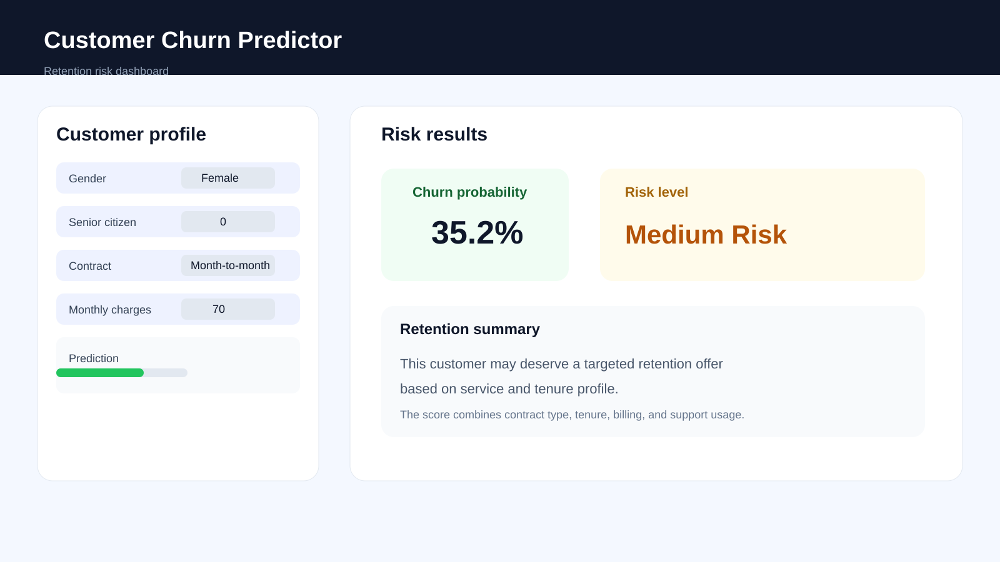

# Customer Churn Prediction

A telecom customer churn prediction project that combines data cleaning, business analysis, exploratory data analysis, machine learning, customer risk scoring, and a Streamlit prediction app.

## Live Demo

[Open the Customer Churn Predictor](https://customerchurnprediction-by-aman.streamlit.app/)

## Project Preview



## Business Problem

Telecom companies want to identify customers who are likely to leave so that retention teams can contact them before churn occurs.

This project answers two questions:

1. What customer characteristics are associated with churn?
2. Which individual customers have the highest predicted churn risk?

## Project Workflow

```text
Raw Telco Data
    -> Data Cleaning
    -> SQL Business Analysis
    -> Exploratory Data Analysis
    -> Feature Engineering
    -> Model Training
    -> Model Evaluation
    -> Risk Scoring
    -> Streamlit Application
```

## Dataset

The project uses a Telco Customer Churn dataset containing customer demographics, account information, subscribed services, charges, and the `Churn` target.

Important columns include:

- `tenure`
- `Contract`
- `InternetService`
- `TechSupport`
- `MonthlyCharges`
- `TotalCharges`
- `Churn`

During cleaning, `TotalCharges` was converted from text to numeric values. Rows with missing `TotalCharges` were removed, leaving 7,032 usable customer records.

## Analysis Performed

The analysis examines churn by:

- Contract type
- Customer tenure
- Monthly charges
- Internet service
- Technical support
- Senior citizen status
- Partner and dependents
- Combined customer segments

## Feature Engineering

The model uses the original customer attributes along with derived features:

- `ChurnFlag`: numeric target where churn is 1 and retention is 0
- `services_count`: number of subscribed services
- `tenure_group`: grouped customer tenure
- `has_security_or_support`: whether the customer has online security or technical support

Categorical variables are one-hot encoded and numeric variables are scaled inside the model pipeline.

## Machine Learning Models

Two classification models were compared:

- Logistic Regression as an interpretable baseline
- Random Forest as a nonlinear tree-based model

The models were evaluated using:

- Accuracy
- Precision
- Recall
- F1-score
- ROC-AUC
- Confusion matrix

For churn retention work, recall and ROC-AUC are especially important because missing a likely churner can be costly.

## Risk Scoring

The selected model generates a churn probability for each customer. Initial risk categories are:

- Below 30%: Low Risk
- 30% to below 70%: Medium Risk
- 70% or higher: High Risk

These thresholds can later be adjusted according to the retention team's capacity and campaign costs.

## Streamlit Application

The Streamlit app allows a user to enter customer information and receive:

- Churn probability
- Risk category

Run the application from the project root:

```powershell
pip install pandas numpy scikit-learn matplotlib seaborn joblib streamlit
streamlit run app\app.py
```

Then open the local URL shown by Streamlit, usually:

```text
http://localhost:8501
```

The app loads the saved model from `models/churn_model.joblib`.

## Project Structure

```text
Customer_Churn_Prediction/
|
|-- app/
|   `-- app.py
|
|-- data/
|   |-- telco_churn.csv
|   |-- cleaned_churn.csv
|   `-- churn_scored.csv
|
|-- images/
|   `-- churn_dashboard.svg
|
|-- models/
|   `-- churn_model.joblib
|
|-- notebook/
|   |-- 01_data_loading.ipynb
|   |-- 02_data_cleaning.ipynb
|   |-- 03_eda.ipynb
|   `-- 04_feature_engineering.ipynb
|
`-- README.md
```

## Add Images to GitHub

To add images to this repository:

1. Put the image file inside the `images/` folder.
2. Use a relative path in Markdown like:

```md

```

3. Commit and push the file:

```bash
git add images/churn_dashboard.svg README.md
git commit -m "Add project dashboard image"
git push origin main
```

You can also upload screenshots from the Streamlit app or charts generated in notebooks to the same `images/` folder.

## Reproducing the Project

1. Install the required Python packages.
2. Run the notebooks in order.
3. Generate the cleaned and scored datasets.
4. Save the trained model to `models/churn_model.joblib`.
5. Run the Streamlit application.

## Business Recommendations

The analysis can support actions such as:

- Targeting high-risk month-to-month customers
- Offering incentives to newer customers
- Reviewing customers with high monthly charges
- Promoting technical support and security services
- Prioritizing retention campaigns using predicted churn probability

## Future Improvements

- Add the Power BI dashboard using `data/churn_scored.csv`
- Add customer-level explanations for risk predictions
- Tune risk thresholds using retention campaign capacity
- Add cross-validation and hyperparameter tuning
- Add automated tests for data preparation and prediction inputs
